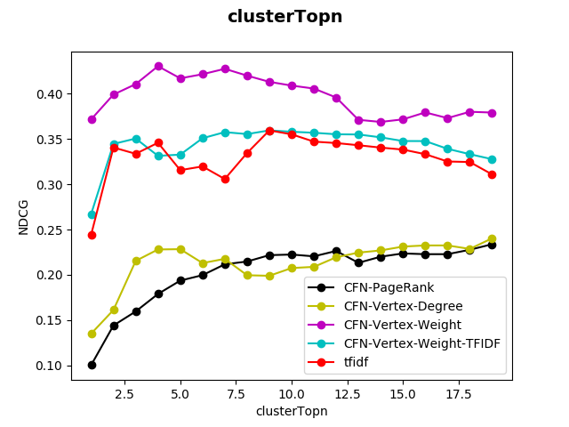

# behavior2text

On Keyword Extraction for User Intention Description based on Smartphone Context Logs

## Experiment


1. Input: Accessibility logs, generating by mobile phone usage activities containing Information Research Intention (IRI).
[基於Context Logs之行動裝置使用者意圖偵測 Detecting Mobile User Intention based on Context Logs](http://www.airitilibrary.com/Publication/alDetailedMesh?docid=U0005-2508201716202100)
```
[
  {
    "category": "4",
    "app": "Chrome",
    "id": "5",
    "context": "墨爾本 天氣 6月 ",
    "time": "2017/07/02 19:46:33",
    "event": "type"
  },
  {
    "category": "4",
    "app": "Chrome",
    "id": "6",
    "context": "墨爾本（Melbourne）天氣- 氣候和溫度- 澳洲旅遊局（Tourism Australia）https://www.australia.com › 資訊 › 澳洲的天氣 冬季（六月至八月） . 在冬天，平均氣溫介乎攝氏6.5至14.2度 （華氏43.7至57.6度），維多利亞東北部，即高地區（High Country）和下雪。天氣經常寒冷多雲，晚上可能會結霜。每年的這個時候，大雨都十分罕見。",
    "time": "2017/07/02 19:48:07",
    "event": "click"
  },
  {
    "category": "4",
    "app": "Chrome",
    "id": "8",
    "context": "[有關澳洲天氣討論] - 背包客棧",
    "time": "2017/07/02 19:48:51",
    "event": "slide"
  },
  {
    "category": "4",
    "app": "Chrome",
    "id": "9",
    "context": "呵呵呵...已經有人在喊我了....其實我看到標題就已忍不住手癢了.... 我去年七月去的....氣溫還好耶..絶不會到 凍壞 的程度...甚至白天太陽出來時,穿太多還會太熱的咧~~ 不過,我也是不那麼怕冷的人啦..... 其實在國外溫度看來低時,通常不像台灣那種 濕冷 ,所以那個8度應該沒有你想的冷...可是厚外套還是要帶的啦! (若真的不幸真的遇到冷的你受不了,給個建議,當地買件羊毛內衣吧...不是有一堆人到澳洲都要特別買些什麼綿羊油,內衣什麼的... ,不過要問我那種好? 這我就不清楚,我一向不太瞎拼的 ) <想當初我也是認為那兒是南半球,氣溫會很低,所以其實也帶了不少衣服去的...可是感覺那兒的冬天沒比我們這兒冷多少....不過我是住在南台灣喔!> 若有要到墨爾本...甚至去看小企鵝...那個南極吹來的風是不可以小看的就是了!(意思是,保暖擋風的要準備好...甚至去看小企鵝時想抓一條毯子去裹身體或披在腿上也是不誇張的啦....別人不會笑你的!)",
    "time": "2017/07/02 19:49:02",
    "event": "click"
  }
  ...
  ...
  ...
]
```
2. Sequence Generation:
Pick one from those templates below

And then fill those blank with Keywords extracted by Methodologies below !
```
[
  {
    "key": [
      "在",
      "查詢",
      "彰化",
      "包子",
      "的",
      "資訊"
    ],
    "replaceIndices": [
      2,
      3
    ]
  }
  ...
  ...
  ...
]
```
3. Methodologies:
Each methodology will assign weights to those keywords

Then, we extract Topn Keywords from Topm clusters in the list sorted by weights of cluster.

It turns out that we'll extract n * m keywords at most!

And then use word2vec to select the best template having the higest similarity  between n * m keywords.

  * KCEM:
    * 
    * We seem all of keyword's hypernyms as a connected component.

      If there has a same hypernym between two keywords, unify it. (Notice: each keyword only has one hypernym, choosing with the highest probability of kcem)

      Use hypernym as Key, real keyword and its frequency as value, sorted by sum of freqency of this connected component.  
    * Selected Keywords:`機場 墨爾本機場 愛華隆機場 墨爾本 `
    * Selected Template:`在查詢<桌子>和<椅子>的資訊`
    * Ouput:`在查詢<愛華隆機場>和<墨爾本>的資訊`
  * KCEM-Union:
    * 
    * Just like KCEM method, but the union condition is not that strict!

      We seem all of keyword's hypernyms and keyword itself as a connected component.

      If there's any intersection between two connected component, unify it.

      Use hypernym of the most frequenest keyword as Key, real keyword and its frequency as value, sorted by sum of frequency of this connected component.
    * Selected Keywords:`澳洲 溫度 墨爾本 交通方式 天氣 愛華隆機場 機場 墨爾本機場`
    * Selected Template:`在查詢<臺南><氣象>的資訊`
    * Output:`在查詢<墨爾本><天氣>的資訊`

  * tfidf:
    * Just calculate its tfidf, and then sorted the list by tfidf.
    * Selected Keywords:`墨爾本 樓主 墨爾本機場`
    * Selected Template:`在查詢<臺北><餐廳>的資訊`
    * Output:`在查詢<墨爾本><墨爾本機場>的資訊`
  * hybrid:
    * The same as KCEM-Union, but use tfidf as value of connected component instead of frequency.
    * Selected Keywords:`墨爾本 愛華隆機場 交通方式 企鵝 天氣 交通工具 機場 墨爾本機場 `
    * Selected Template:`在查詢<汽車><性能>的資訊`
    * Output:`在查詢<交通工具><天氣>的資訊`
  * contextNetwork:
    * The same as KCEM-Union, but use indegree as value of connected component instead of frequency.
    * Selected Keywords:`南半球 風是 冬季 交通 墨爾本機場 巴士 交通方式 愛華隆機場 `
    * Selected Template:`在查詢<汽車><性能>的資訊`
    * Template:`在查詢<巴士><天氣>的資訊`
  * pagerank:
    * The same as KCEM-Union, but use pagerank score as value of connected component instead of frequency.
    * Selected Keywords:`南半球 冬季 企鵝 墨爾本機場 愛華隆機場 火車 交通方式 巴士 `
    * Selected Tempalte:`在查詢<臺中><火車>的資訊`
    * Output:`在查詢<冬季><火車>的資訊`

## Benchmark:
Use these ranking data to calculate NDCG

```
[
  {
    "0": {
      "綠島": 5,
      "蘭嶼": 4,
      "富岡漁港": 3,
      "韓國": 2,
      "馬祖": 1
    },
    "1": {
      "旅行": 4,
      "旅遊": 5,
      "自由行": 3,
      "民宿": 1,
      "行程": 2
    },
    "file": "G701D5A1921C1BAE5530242377BD5349-IRI-1.json"
  }
  ...
  ...
  ...
]
```
  * Use percentage of accessibility Log as hyperparameter, x-axis is percentage:
  * Use ClusterTopn as hyperparameter, x-axis is ClusterTopn:
  * Use Topn as hyperparameter, x-axis is Topn:

## Installing

`pip install behavior2text`

## Running

### Apis

url domain:<http://udiclab.cs.nchu.edu.tw>

1. Generate Sequence with Accessibility logs：_`/behavior2text`_

  - method:`tfidf, kcem, kcemCluster, hybrid, contextNetwork, pagerank`
  - clusterTopn: the amount of clusters chosen from contextNetwork generated by specific method
  - topN: the amount of keywords chosen from clusters.
  
  - example code:
    ```
    import requests, json
    d = json.dumps(accessibility Log!!!)
    print(requests.post('http://udiclab.cs.nchu.edu.tw/behavior2text/',data={'data':d, 'method':'kcemCluster','topN':3,'clusterTopn':3}).json())
    ```

  - result:
    ```
    {'clusterTopn': '3', 'topN': '3', 'sentence': '在查詢季節X的資訊', 'method': 'kcemCluster'}
    ```

### Commands

1. `python3 manage.py experiment --topNMax=<(optional) at least 2> --clusterTopnMax=<(optional) at least 2> --percentageMax=<at least 2>`:
    * show NDCG of sequences when using each kind of methods: tfidf, kcem, kcemCluster, hybrid, contextNetwork, pagerank
    * (Optional Usage): `python3 experiment.py`
2. `python3 manage.py sentence --method=<> --debug=<True/False>`:
    * show sequences with those accessibility using provided method below
    * method:tfidf, kcem, kcemCluster, hybrid, contextNetwork, pagerank
3. `python3 __init__.py <method>`:
    * tfidf
    * kcem
    * kcemCluster
    * hybrid
    * contextNetwork
    * pagerank

### Settings

1. `settings.py`裏面需要新增`behavior2text`這個app：

  - add this:

    ```
    INSTALLED_APPS=[
    ...
    ...
    ...
    'behavior2text',
    ]
    ```

2. `urls.py`需要新增下列代碼 把所有search開頭的request都導向到`behavior2text`這個app：

  - add this:

    ```
    import behavior2text.urls
    urlpatterns += [
        url(r'^behavior2text/', include(behavior2text.urls))
    ]
    ```

3. `python manage.py runserver`：即可進入頁面 `127.0.0.1:8000/behavior2text` 測試 `behavior2text` 是否安裝成功。

## Deployment

`behavior2text` is a django-app, so depends on django project.

## Test

`python3 manage.py test behavior2text`

## Built With

- numpy
- scipy
- requests
- pyprind
- udicOpenData

## TODO

挑選template以及把keyword填入template中，應該需要參考多種同類型的template避免偏差

例如：
  * Selected Keyword:`南半球 冬季 企鵝 墨爾本機場 愛華隆機場 火車 交通方式 巴士`
  * Selected Template:`在查詢<臺中>火<車的>資訊`
  * Output:`在查詢<冬季><火車>的資訊`

因為keyword和template中都有火車，導致火車會被優先挑選，造成偏差

## Contributors

- **張泰瑋** [david](https://github.com/david30907d)

## License

This package use `GPL3.0` License.