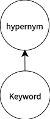

# behavior2text

On Keyword Extraction for User Intention Description based on Smartphone Context Logs

## Experiment


1. Input: Accessibility logs, generating by mobile phone usage activities containing Information Research Intention (IRI).
[基於Context Logs之行動裝置使用者意圖偵測 Detecting Mobile User Intention based on Context Logs](http://www.airitilibrary.com/Publication/alDetailedMesh?docid=U0005-2508201716202100)
```
[
  {
    "category": "4",
    "app": "Chrome",
    "id": "5",
    "context": "臺北兩天一夜",
    "time": "2017/07/02 19:46:33",
    "event": "type"
  },
  {
    "category": "4",
    "app": "Chrome",
    "id": "6",
    "context": "【臺北景點】臺北一日遊/臺北兩天一夜/臺北好吃好玩景點(私心推薦)-冰蹦拉...",
    "time": "2017/07/02 19:48:07",
    "event": "click"
  }
  ...
  ...
  ...
]
```
2. Sequence Generation:
Pick one from those templates below

And then fill those blank with Keywords extracted by Methodologies below !
```
[
  {
    "key": [
      "在",
      "查詢",
      "彰化",
      "包子",
      "的",
      "資訊"
    ],
    "replaceIndices": [
      2,
      3
    ]
  }
  ...
  ...
  ...
]
```
3. Methodologies:
Each methodology will assign weights to those keywords

Then, we extract Topn Keywords from Topm clusters in the list sorted by weights of cluster.

It turns out that we'll extract n * m keywords at most!

And then use word2vec to select the best template having the higest similarity  between n * m keywords.

  * KCEM:



We seem all of keyword's hypernyms as a connected component.

If there has at least one same hypernym between two connected component, unify it.

Use hypernym as Key, real keyword and its frequency as value, sorted by sum of freqency of this connected component.
```
{
  "離島": {
    "count": 118,
    "key": {
      "綠島": 80,
      "蘭嶼": 38
    }
  },
  "操作系統技術": {
    "count": 35,
    "key": {
      "行程": 35
    }
  },
  "旅遊": {
    "count": 30,
    "key": {
      "自由行": 9,
      "環球飛行": 2,
      "旅遊住宿": 15,
      "旅行": 4
    }
  }
}
```

  * KCEM-Union:


Just like KCEM method, but the union condition is not that strict!

We seem all of keyword's hypernyms and keyword itself as a connected component.

If there's any intersection between two connected component, unify it.

Use hypernym of the most frequenest keyword as Key, real keyword and its frequency as value, sorted by sum of frequency of this connected component.
```
{
  "離島": {
    "key": {
      "韓國": 4,
      "住宿": 15,
      "環球旅行": 2,
      "旅行社": 2,
      "海洋": 10,
      "旅行": 4,
      "旅遊": 22,
      "旅遊景點": 1,
      "臺灣": 2,
      "離島": 2,
      "溫泉": 2,
      "臺東": 5,
      "蘭嶼": 36,
      "交通": 11,
      "島嶼": 10,
      "蘭嶼開元港": 2,
      "規劃": 11,
      "冒險": 2,
      "景點": 7,
      "遊記": 2,
      "馬祖": 5,
      "行程": 35,
      "自由行": 9,
      "遊行": 1,
      "韓文": 2,
      "服務": 2,
      "火燒島": 1,
      "二日遊": 2,
      "綠島": 80
    },
    "count": 289
  },
  "旅館類型": {
    "key": {
      "民宿": 22
    },
    "count": 22
  },
  "google搜尋": {
    "key": {
      "google搜尋": 16
    },
    "count": 16
  }
}
```

  * tfidf:
Just calculate its tfidf, and then sorted the list by tfidf.
```
{
  "galaxy":41.72104244821227,
  "蜜粉":39.45028362842932,
  "samsung":35.82365543350755,
  ...
  ...
  ...
}
```
  * hybrid:
The same as KCEM-Union, but use tfidf as value of connected component instead of frequency.

```
{
  "離島": {
    "key": {
      "馬祖": 22.812636061002312,
      "韓國": 12.28856330918774,
      "島嶼": 19.084689345170105,
      "遊記": 14.742401880463753,
      "臺東": 19.25972315629526,
      "冒險": 11.572864538743522,
      "旅行社": 14.621681032386105,
      "海洋": 21.42152881180279,
      "規劃": 18.22662935419741,
      "交通": 18.467362583669633,
      "韓文": 13.897955403834649,
      "景點": 19.15129458011237,
      "行程": 32.48313404495418,
      "綠島": 49.234175255426,
      "住宿": 28.309421028803154,
      "二日遊": 23.16094204946314,
      "離島": 13.929111149649614,
      "自由行": 29.674035164089894,
      "蘭嶼開元港": 23.84745415407191,
      "溫泉": 12.792187057373232,
      "環球旅行": 18.146126713419054,
      "蘭嶼": 42.67154205712718,
      "臺灣": 6.692997837648712
    },
    "count": 276
  },
  "旅館類型": {
    "key": {
      "民宿": 40.512122452497245
    },
    "count": 22
  },
  "google搜尋": {
    "key": {
      "google搜尋": 39.9375716772893
    },
    "count": 15
  }
}
```
  * contextNetwork:
The same as KCEM-Union, but use indegree as value of connected component instead of frequency.
  * pagerank:
The same as KCEM-Union, but use pagerank score as value of connected component instead of frequency.

4. Benchmark:
Use these ranking data to calculate NDCG

```
[
  {
    "0": {
      "綠島": 5,
      "蘭嶼": 4,
      "富岡漁港": 3,
      "韓國": 2,
      "馬祖": 1
    },
    "1": {
      "旅行": 4,
      "旅遊": 5,
      "自由行": 3,
      "民宿": 1,
      "行程": 2
    },
    "file": "G701D5A1921C1BAE5530242377BD5349-IRI-1.json"
  }
  ...
  ...
  ...
]
```


## Installing

`pip install behavior2text`

## Running

### Apis

url domain:<http://udiclab.cs.nchu.edu.tw>

1. Generate Sequence with Accessibility logs：_`/behavior2text`_
  
  - example code:
  ```
  秉宏交給你了
  秉宏交給你了
  秉宏交給你了
  秉宏交給你了
  import requests
  requests.post(秉宏交給你了)
  秉宏交給你了
  秉宏交給你了
  秉宏交給你了
  秉宏交給你了
  ```

  - result:
  ```
  在查詢臺東民宿的資訊
  ```

### Commands

1. `python3 manage.py experiment --topNMax=<(optional) at least 2> --clusterTopnMax=<(optional) at least 2> --accessibilityTopnMax=<at least 2>`:
    * show NDCG of sequences when using each kind of methods: tfidf, kcem, kcemCluster, hybrid, contextNetwork, pagerank
    * (Optional Usage): `python3 experiment.py`
2. `python3 manage.py sentence --method=<> --debug=<True/False>`:
    * show sequences with those accessibility using provided method below
    * method:tfidf, kcem, kcemCluster, hybrid, contextNetwork, pagerank
3. `python3 __init__.py <method>`:
    * tfidf
    * kcem
    * kcemCluster
    * hybrid
    * contextNetwork
    * pagerank

### Settings

1. `settings.py`裏面需要新增`behavior2text`這個app：

  - add this:

    ```
    INSTALLED_APPS=[
    ...
    ...
    ...
    'behavior2text',
    ]
    ```

2. `urls.py`需要新增下列代碼 把所有search開頭的request都導向到`behavior2text`這個app：

  - add this:

    ```
    import behavior2text.urls
    urlpatterns += [
        url(r'^behavior2text/', include(behavior2text.urls))
    ]
    ```

3. `python manage.py runserver`：即可進入頁面 `127.0.0.1:8000/behavior2text` 測試 `behavior2text` 是否安裝成功。

## Deployment

`behavior2text` is a django-app, so depends on django project.

`behavior2text` 是一般的django插件，所以必須依存於django專案

## Test

`python3 manage.py test behavior2text`

## Built With

- numpy
- scipy
- requests
- pyprind
- udicOpenData

## Contributors

- **張泰瑋** [david](https://github.com/david30907d)

## License

This package use `GPL3.0` License.